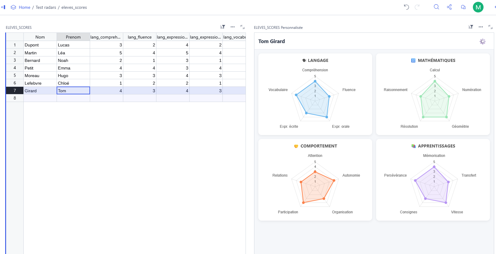

# Grist Widgets

> 🇫🇷 [Lire en français](README.fr.md)

Custom widgets for [Grist](https://www.getgrist.com/), freely reusable and adaptable.

---

## 📡 widget_radar.html — Multi-category radar charts

Displays scores on multiple axes as radar (spider) charts, directly inside Grist. Ideal for analysing student profiles, multi-criteria assessments, or any multi-dimensional dataset.

### Features

- Display **N radar charts** (unlimited) arranged in a 2-column grid
- **Persistent configuration** via Grist widget options (saved between sessions)
- Per chart, configure:
  - Title and emoji
  - Outline colour
  - Grid colour
  - Maximum scale (e.g. 0–5, 0–10…)
  - Columns to include (checked from the full column list)
- Add, remove and reorder charts from the ⚙️ panel
- Auto-update on record click
- **Presentation mode**: opens a dedicated tab (`presenter.html`) with keyboard navigation and full-screen support
- **Built-in language toggle** (FR / EN): preference stored in Grist widget options

### Files

| File | Purpose |
|---|---|
| `widget_radar.html` | Widget to embed in Grist |
| `presenter.html` | Full-screen presentation page (opened automatically) |

Both files must be hosted **at the same location**.

### Installation

#### 1. Host the files

Widgets must be served from a host that allows iframe embedding. [Netlify](https://netlify.com) works perfectly and is free:

1. Download `widget_radar.html` and `presenter.html`
2. On Netlify: **Add new site → Deploy manually** → drag-and-drop a folder containing both files
3. Netlify gives you a URL like `https://your-site.netlify.app/widget_radar.html`

> ⚠️ GitHub Pages and jsDelivr do not work as they block iframe embedding.

#### 2. Add the widget in Grist

1. In your Grist document, add a **Custom Widget**
2. Paste the Netlify URL of `widget_radar.html` in the URL field
3. Set **"Select by"** to your data table
4. Set **Data access** to **"Read table"**
5. Click on a record → charts appear

#### 3. Configure the charts

Click **⚙️** at the top right of the widget to open the configuration panel.

#### 4. Switch language

Click **FR/EN** to toggle between French and English. The preference is stored in Grist widget options and persists across sessions.

#### 5. Presentation mode

Click **▶ Present** to open `presenter.html` in a new tab with:

- **← →** keyboard navigation between records
- Native **full-screen** button
- Position counter (**3 / 7**)

### Expected data structure

One row = one record (e.g. a student). Scores are in numeric columns, ideally prefixed by category:

| Column | Description |
|---|---|
| `lang_comprehension` | Comprehension score (Language) |
| `math_calcul` | Calculation score (Maths) |
| `compor_attention` | Attention score (Behaviour) |
| … | … |

Column names are fully configurable from the ⚙️ panel.

A demo CSV file (`eleves_scores.csv`) is available for quick testing with sample data.

### Accessibility

This widget targets W3C/WCAG 2.1 AA compliance:
- All icon buttons have explicit `aria-label` attributes
- The configuration panel uses `role="dialog"` with focus trap, Escape key support, and focus restoration
- Accordion headers are keyboard-navigable (Enter / Space)
- Canvas elements have `role="img"` and `aria-label`
- All interactive elements have visible `:focus-visible` styles
- Labels are programmatically associated with their inputs via `for`/`id`

### Dependencies

- [Chart.js 4.4](https://www.chartjs.org/) — loaded via CDN
- [Grist Plugin API](https://support.getgrist.com/widget-custom/) — loaded via CDN

---

## 🔧 widget_debug.html

Utility widget to diagnose communication between Grist and a custom widget. Displays the raw content of the selected record as JSON. Useful for verifying that "Select by" and data access are correctly configured.

---

## Licence

[MIT](LICENSE) — free to use, modify and redistribute, with credit to the original author.

---

## Contributing

Contributions are welcome! Feel free to open an *issue* or a *pull request* to suggest improvements or new widgets.
